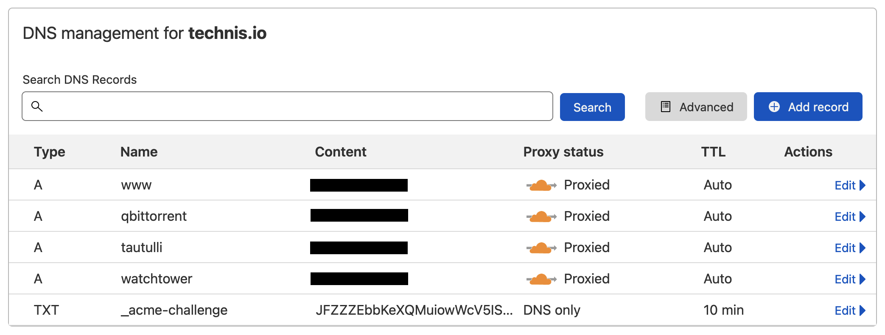
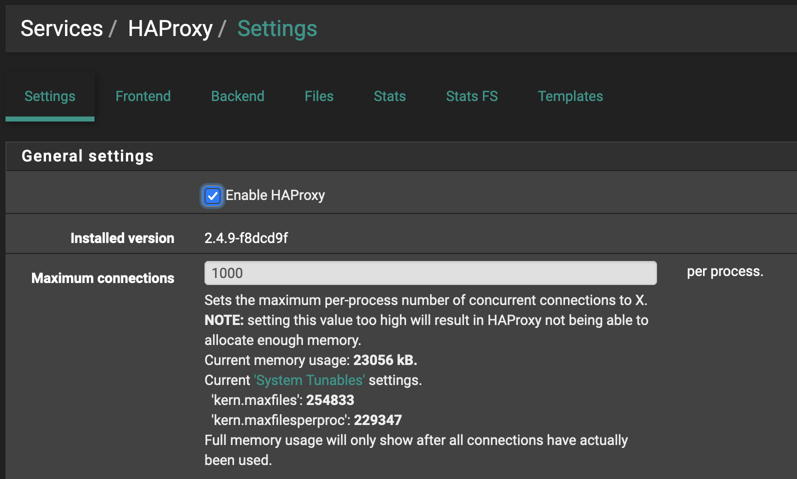
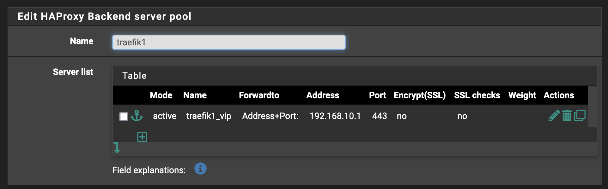
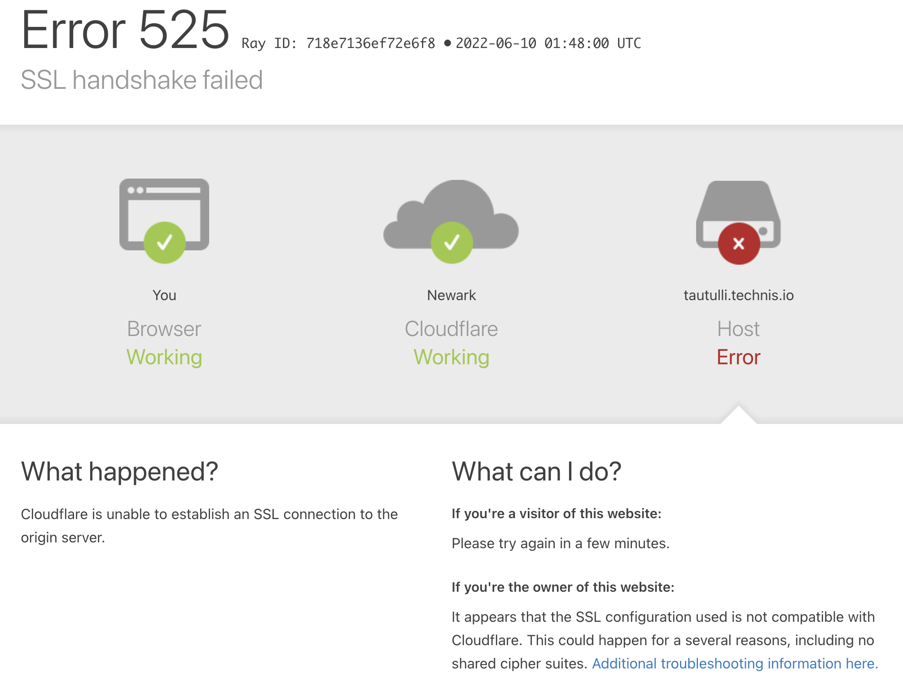
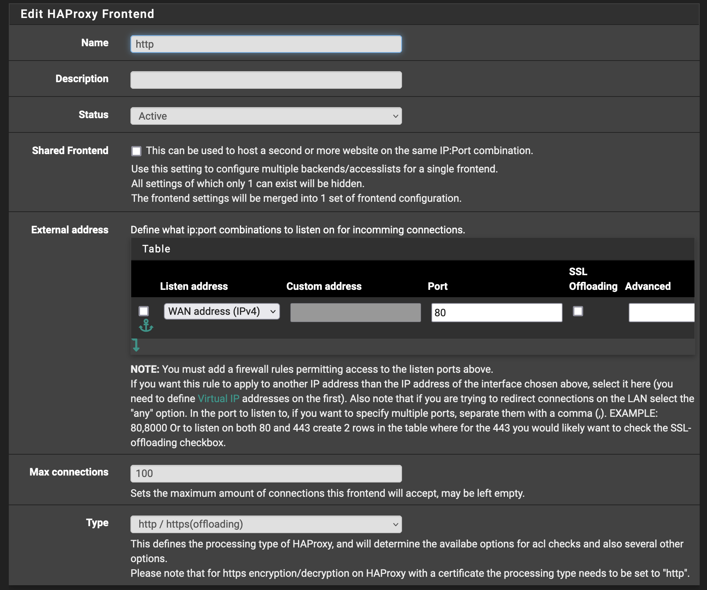
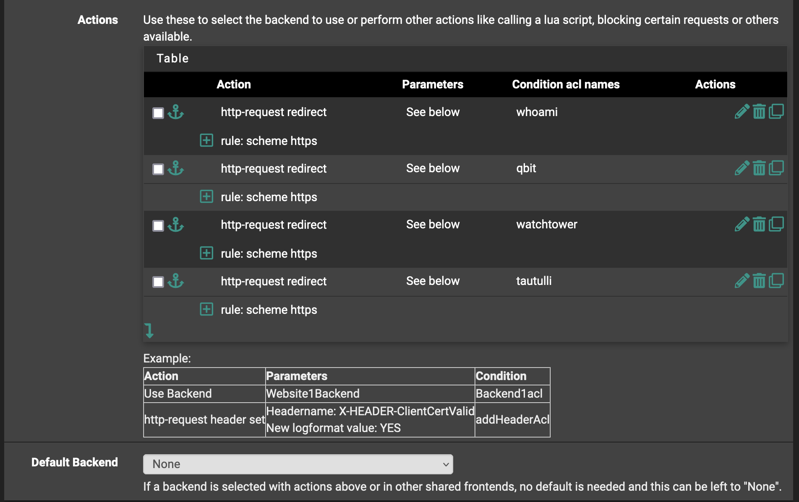
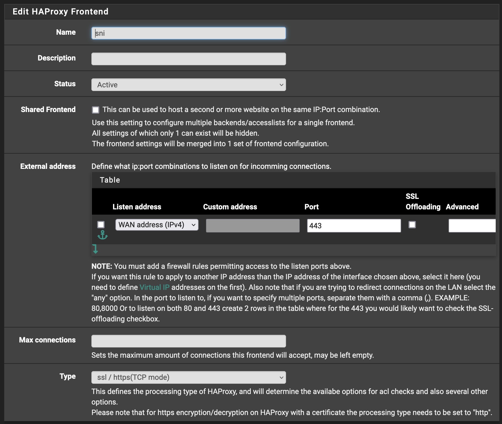

HAProxy is a very powerful load balancer and reverse proxy. Honestly, I have not given it the time of day since the ol' days (when Nginx was the one to beat) and since then have grown to prefer Traefik. Traefik is simple to set up, versatile when you need it to be and its ubiquity is unmatched. It is even built into K3s!

Speaking of K3s, I currently run two Kubernetes clusters in my homelab both leveraging K3s and Traefik.

The TrueNAS SCALE "cluster", `illmatic`, is my _NAS_ (:sweat_smile:). It has K3s built-in and a growing catalog of popular apps that can be installed with a few clicks. I recently learned about [TrueCharts](https://truecharts.org/) and immediately migrated a few apps from my vanilla K3s cluster, `hades`, to soak in the added conveniences (\*TBD in another post). Still, given TrueNAS SCALE's lack of HA capabilities, and an unanswered gap of flexibility in its underlying configurations, `hades` remains home to most of my experimentation (plug: [`github.com/jovalle/technis`](https://github.com/jovalle/technis)) and apps I'm too lazy to migrate over.

Both clusters have apps that I would like to expose to the internet so that friends, family, and I can access without having to drive into wifi range. In the past, I had configured a wildcard of `*.techn.is` via Cloudflare to my public IP. CF would redirect all traffic on `:80` to `:443` and pfSense would NAT/port-forward to Traefik on `hades` via a `LoadBalancer` service (\*powered by metallb)

There are glaring security risks here in that with a wildcard, anything and everything serviced by Traefik will be accessible from the internet. In my (little) defense, an attacker would need to brute force host names until they hit the right ones and virtually all exposed services had some form of authentication required (basic auth forms). Still, it was uneasy thinking new apps could be accessed from the internet before I got a chance to lock them down and so I tore down the wildcard in favor of explicitly defined DNS records. Cloudflare would then deny any other request (e.g. `keys2kingdom.techn.is`).

With migrating some apps to `illmatic`, the singular port forwarding no longer sufficed as it can only forward to one internal IP without causing intermittent failures (e.g. something silly like round-robin between clusters).

This is where HAProxy comes in.

HAProxy will now serve as the global reverse proxy (and in future load balancer), playing traffic controller between the two clusters as well as any other endpoints in the homelab.

To get started, we must first install HAProxy on the pfSense box.

We want `haproxy`. Avoid `haproxy-devel` which in my experience fails one too many times on routine configuration changes.

Once installed, head over to `Services -> HAProxy` so that we may begin configuring. Under `Settings`, make sure `Enable HAProxy` is checked and saved. All else can remain stock.

Under the `Backend` tab, we define each of the backends (in this case two Traefik instances) that HAProxy will forward traffic to.

Here we have the first of two. Copypasta the config and tweak accordingly for the second.

Notice that we have SSL encryption and SSL checks turned off. I have each Traefik instance configured with its own TLS (\*) and thus do not want HAProxy to reencrypt or overcomplicate that flow.

I also found that the health check method must be set to `none` for Cloudflare to behave. YMMV. If you see the following `SSL handshake failed` error, it is likely due to this health check.

Once the backends are configured, start defining one of two frontends. The first is the `http` frontend which we will use to redirect all HTTP request to the HTTPS frontend.

Set the name to anything you'd like, but be sure to se the `Listen address` to the `WAN address` and the `port` to `80` so that HAProxy can listen in on said port. Another important detail is to set the type to `http / https(offloading)` so that we can use host headers for the ACLs.

Now we set the ACLs for each of the host headers we'll be explicitly forwarding to particular backends.

Lastly, we set the actions for each of the ACLs to redirect to HTTPS.

But what of the HTTPS? Well that's the next and last frontend we must define. Return to the `Frontend` tab and add a new one. I called my `sni` since that is what will be employed over `:443`. Much overlap with the `http` frontend. Key differences include the change of WAN address port, and the frontend type now set to `ssl / https(TCP mode)`.

For the ACL, instead of redirects to HTTPS, we leverage matching via SNI TLS for the full FQDNs.

Follow along until the actions where we finally define the proper backend for each ACL

Save, apply, and that's it! You're done! Assuming your Traefik instance is configured properly (\*) and the SNI values are matching, you should see your app serviced from the internet!

