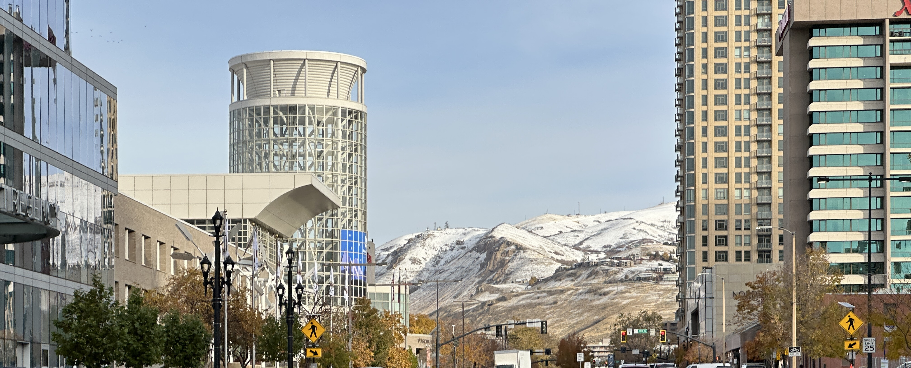

Welcome to my recap of this year's Kubernetes Convention in Salt Lake City! I had the privilege of attending not only
the main KubeCon event but also several satellite conferences that showcased the vibrant Cloud Native community. Here's
a day-by-day breakdown of my experiences, insights, and highlights.

## Day 0: Arrival in Salt Lake City (Saturday)

The Journey Begins. We're outside!

Bright and early I head to JFK and 4 short hours later find myself in Salt Lake City! Never been to Utah, or any western
state outside of California and Texas, so I had high (pun-intended) expectations. The mountain views as we touched down
were stunning!

Fun fact: SLC sits 4,200ft above sea level. I did not notice the altitude change though someone in the group did and was
out of commission for the first day as they adjusted.

I certainly knew I was in the right place seeing fellow passengers with, sometimes not so, subtle Kubernetes adornments.

## [Day 1: Cloud Native Rejekts (Sunday)](../10-cloud-native-rejekts)

## [Day 2: WasmCon (Monday)](../11-wasmcon)

## [Day 3: Cilium + eBPF Day (Tuesday)](../12-cilium-ebpf-day)

## [Day 4: On the First Day of KubeCon: A Pod in an Argo App Tree (Wednesday)](../13-day-one)

## [Day 5: On the Second Day of KubeCon: Two Helms Charts Spinning (Thursday)](../14-day-two)

## [Day 6: On the Third Day of KubeCon: Three Control Plane Nodes Humming (Friday)](../15-day-three)

And a happy Jay sipping the CNCF mocktail, "King's Peak", of coke, mango, and pear, underneath the
CNCF Landscape Tree!

