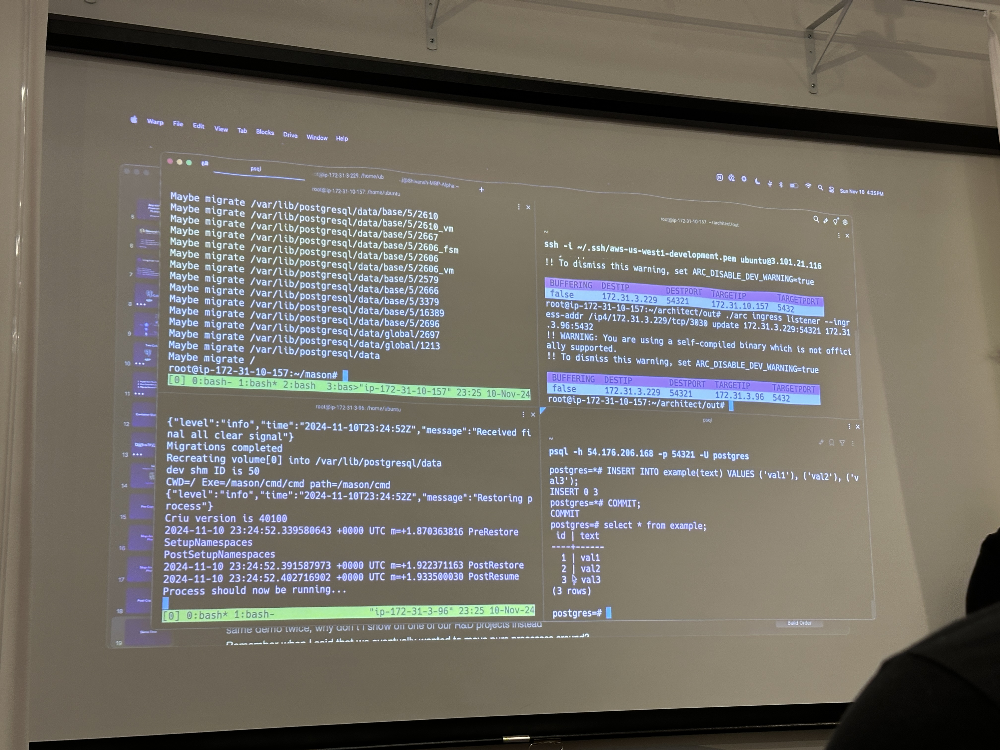

- [What is Cloud Native Rejekts?](#what-is-cloud-native-rejekts)
- [Venue](#venue)
- [Notable Sessions](#notable-sessions)
  - [Malicious Compliance Automated: When You Have 4000 Vulnerabilities and only 24 Hours Before Release](#malicious-compliance-automated-when-you-have-4000-vulnerabilities-and-only-24-hours-before-release)
  - [Debug Like a Pro: Ephemeral Containers and Wolfi Linux in Action](#debug-like-a-pro-ephemeral-containers-and-wolfi-linux-in-action)
  - [Integrating eBPF superpowers into your observability tooling](#integrating-ebpf-superpowers-into-your-observability-tooling)
  - [Stateful App Migration with Zero Downtime](#stateful-app-migration-with-zero-downtime)
- [Worthy Mentions](#worthy-mentions)
- [Social Connections](#social-connections)

## What is Cloud Native Rejekts?

A fantastic pre-KubeCon event showcasing the “rejected” but equally impactful talks. Each talk is up to 30min with 5min
lightning talks sprinkled across the day.

## Venue

This year's event was hosted at [Kiln](https://maps.app.goo.gl/dWFEufoh9drCqRRP9), a coworking space featuring desks and
private offices, home to numerous local startups and their teams. The geeky aesthetics were pleasantly welcoming despite
the labyrinthine floor plan. Migrating between the theater and flex space downstairs felt like a game of Pac-Man with
many steps and sharp turns.

## Notable Sessions

### Malicious Compliance Automated: When You Have 4000 Vulnerabilities and only 24 Hours Before Release

The future of container vulnerabilities is a bit scary.

Duffie of Isovalent and Kyle, creator of DockerSlim, walked us through the gains to be had with image minification,
demonstrating significant dents in build times and overall footprint. What was most memorable was seemed like the other
side of the coin, image obfuscation. Removing package metadata CVE scanners tend to rely on to enumerate components and
respective risk.

Can't attack what you can't see I guess.

Although such cleansing relatively eradicated the CVEs identified,
nothing can be so straightforward (or free). They went on to note that attackers would be just as SOL as the CVE scanners
in figuring out what packages are running let alone what versions are deployed.

Could this catalyze a shift or expansion in attacking methodologies to include more brute force techniques? Imagine the
need then for a rainbow table of bytecode snippets (signatures) used to identify packages and maybe even specific versions
(binary fingerprinting). This would largely undo the perceived hardening of image minification and obfuscation (albeit
binary obfuscation could remain effective). With more adoption, we may see more than just APTs and the like justifying it.

### Debug Like a Pro: Ephemeral Containers and Wolfi Linux in Action

Hey, Scratch! Meet ephemeral pods/sidecars. 😅

I went into this expecting new and interesting ways to debug containers, especially with all the Ozempic-like slimming
going around (with good reason, specifically in the context of container images). Throwing everything but the kitchen sink
is a proven method for enhancing performance, minimizing waste and amplifying security. Slim base images like `Wolfi Linux`
threaten the ubiquity of `Alpine` by somehow pushing the footprint needle even closer to `scratch`.

Unfortunately, the talk never crossed the bridge, advocating not only for smaller images but using smaller images for
debugging. Okay.

I use debug images all the time, mostly `nicolaka/netshoot` but have also created a few of my own like `jovalle/plex0r`
for more specific use cases (e.g. injecting data into a PV while migrating workloads from Docker to Kubernetes).

### Integrating eBPF superpowers into your observability tooling

🎵 doo-doo-doo-doo-doo, Inspektor Gadget, doo-doo-doo-doo-doo, doo-doo (hoo hoo!) 🎶



What a great name. I've seen and heard of this project before but anytime I hear it uttered aloud, it triggers fond
childhood memories of watching the show.

The name is rather fitting. In the ways the Inspector would issue a command, "go go gadget $GADGET_NAME", users can just
as quickly leverage a `gadget`. The project has a growing catalog of data collection and system inspection tools, all
powered by eBPF. A couple of note:

| Gadget | Use Case |
|---|---|
| profile_tcprtt | RTT histograms |
| traceloop | Trace system calls issued by containers |

In the demo, they showcased using gadgets to track and alert on any `kubectl exec` calls.

### Stateful App Migration with Zero Downtime

This talk was really interesting! The idea of a live migration is often conversed in the realm of Kubernetes but is often
laden with compromises. Whether it be the tangible blips to tolerate or the occasional (multi-step) manual intervention
that amplifies human error sensitivities, it broadly seems impossible to do easily and quickly.

With all that said, the founder of [Loophole Labs](https://loopholelabs.io/) came in with a handful of bold claims:

- zero downtime 👀
- hypervisor/platform agnostic 🫣
- migrate any workload 🤯

The migration is made possible a project of theirs, [Silo](https://github.com/loopholelabs/silo), which allows for migrating
actively used storage without any performance impact. Building atop of that, they can now migrate running apps.

The migration was divided into three phases:

1. Pre-copy (copy memory and disk)
2. Stop-and-copy (copy bare data such as CPU state, registers, etc.)
3. Post-copy (data is validated as latest and processes pick up where they left off often with close to 0 hiccup)

In the demo, they elected to target one of the most logistically challenging workloads, a Postgres instance. To spice
things up, `SELECT` and `INSERT` operations were firing before, during and after the migration. Once such operation,
stopped dead in tracks (without terminating) mid-migration.

Not long after, the post-copy phase concluded as did the hung query. No data corruption or errors.

Zero downtime and impact confirmed! ✅

The folks at Loophole Labs are working to take this another step further in migrating live processes. In the current
iteration, they constrained the scope to the boundaries of a micro VM, By design, the VM contains all the processes,
namespaces, and OS state (think VMotion but without the vendor lock-in). For migrating live processes, they are working
with eBPF to dismantle and piece together again each network connection (with no performance impact!). Really exciting
space.

## Worthy Mentions

- For better or worse, Prometheus is like the eye of Sauron

- Ansible really is just "artisanal shell scripts"
- QEMU is great tech for virtualization but one of the worst options for multi-arch image building
- Karpenter proven better for provisioning at scale. CAS is more fitting in homogenous environments with up to ~75 clusters.

## Social Connections

I had the opportunity to network with some fantastic people.

- Met Viktor, a YouTube celebrity in my eyes known for hosting the DevOps Toolkit channel
- Spoke with a few folks from Cosmonic, Google, and Isovalent
