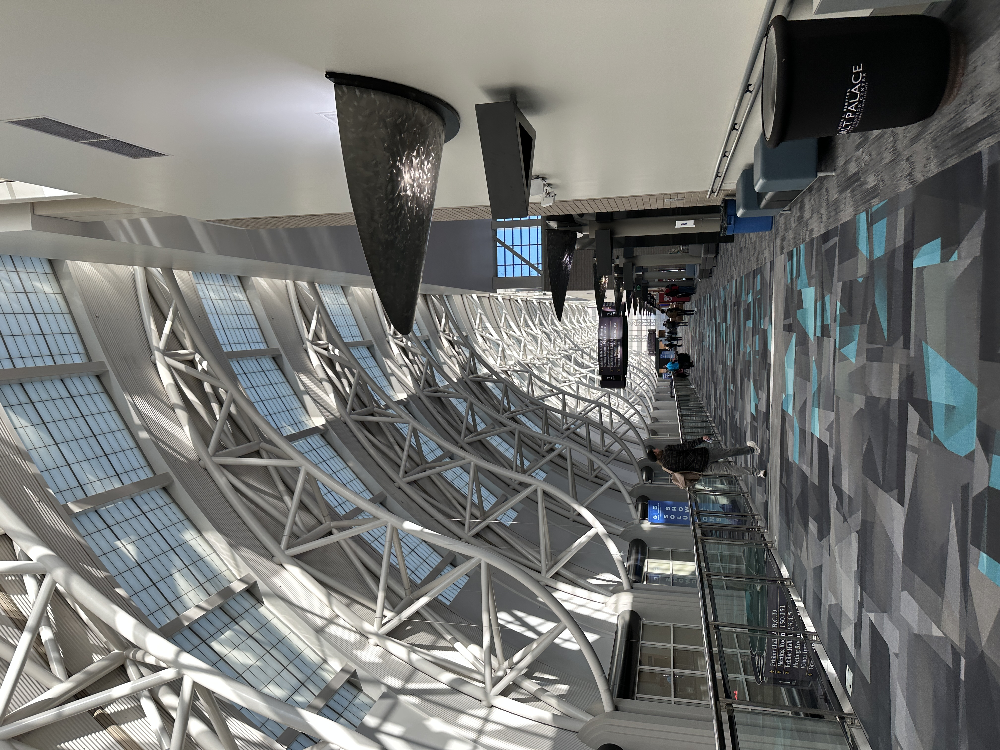

Cloud Native Rejekts is a two-day event but I unfortunately could not split my time between the two venues, especially
given the distance between Kiln and the convention center. I decided to focus on WasmCon talks.

The event kicked off with a Choose Your Own Adventure workshop led by the folks at Cosmonic, the presumptive pioneers of
WebAssembly (Wasm).

The workshop was jam packed with technologists from all around and the density was quickly felt as the wifi experience
suffered tremendously. We were tasked with downloading a few tools like `wash` and `wasm-tools` to get started. The two
totaled ~40MB and took me ~10min to procure. 😰 Maybe Wasm routers would have helped. 🤷🏽‍♂️😅 Once installed, we were off to
the races. The provided boilerplate used `TinyGo` (the only golang compiler currently supported by Wasm) to walk us
through writing a cute dog image generator (Rasma, you missed out! 😄).

With `wasm32-wasip2` set as the compile target I had two `.wasm` files to show for it all. The two bytecode artifacts
amassed a total of `9472KB`. I then compiled the same code in native go and it totalled `46640KB`! 80% reduced fat!!! 🫥

This is the bread and butter value of Wasm. Plug-in your code from any* language and you'll now be able to deploy anywhere
with a relatively microscopic footprint. This sort of breakthrough will make room for so many resources, resources that
can then be used for... more Wasm programs!

*popular modern languages (e.g. go, rust)
