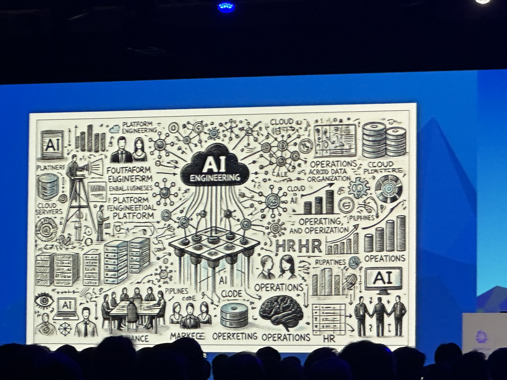
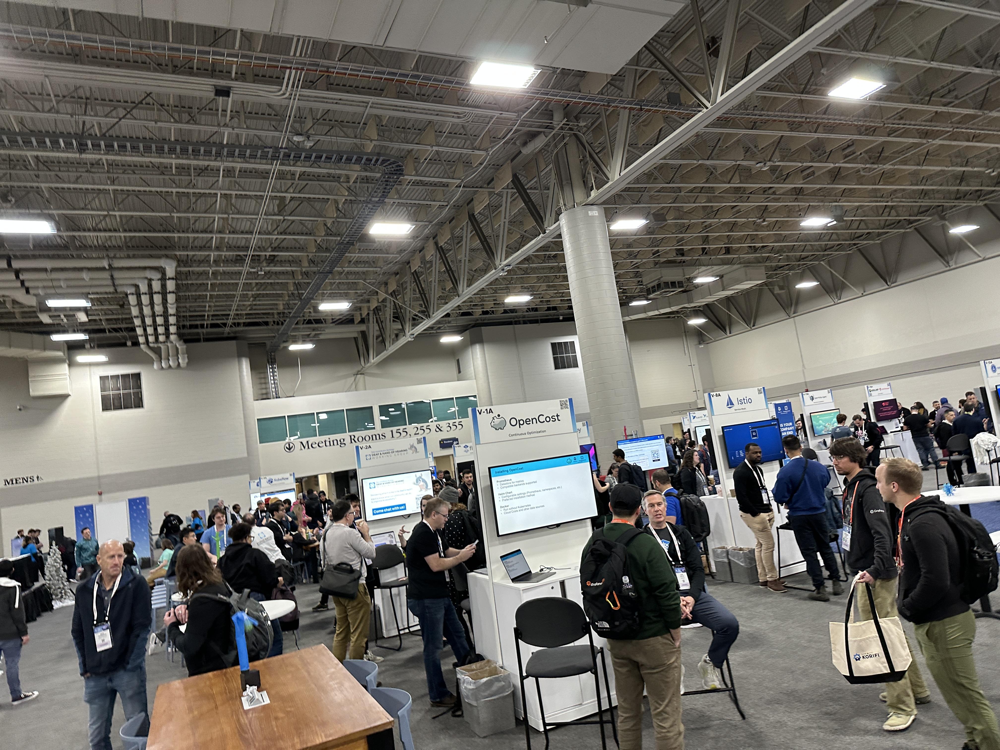

The main event begins! Outside of the initial advisory on combatting patent trolls and the war the CNCF is waging against
them, the keynotes were underwhelming.

Much sponsored AI talk. Exhibit A:

The Solutions Showcase hall was massive and buzzing with traffic. Countless vendors, learning booths, research presentations.

## Today's Sessions

- SIG Network Intro and Updates
- Best Friends Keep No Secrets: Going Secretless with cert-manager
- Cilium, eBPF, WireGuard: Can We Tame the Network Encryption Performance Gap?
- Life of a Packet: Ambient Edition
- CNI Updates and Direction!
- Creating Paved Paths for Platform Engineers
- 🪧 Poster Session (PS08): Unveiling Anomalies: eBPF-Based Detection in High-Volume Encrypted Network Traffic

## Session Highlights

- SIG Networking.
  - Network Policy Enhancement Proposals (NPEPs)
    - FQDN support!
    - AdminNetworkPolicy
      - Global "tier" ahead of NetworkPolicy
      - No implicit deny; no match fall through
      - Explicit Allow/Pass/Deny
      - Implemented by Antrea, OVN, Calico, KubeOVN, kube-network-policies (Cilium in the roadmap)
    - BaselineAdminNetworkPolicy
      - Singleton policy
      - Applies only if no netpols apply to workload
        - Replaces "allow by default"
    - Tenant Isolation
    - Policy Assistant
      - policy simulation tool
      - can get policy/pods/etc from
      - cluster
      - nodes
  - Had a great conversation with Casey Davenport and Shaun Crompton of Tigera about SIG dynamics and the contributor track
- Daniel Borkmann, one of the talents at Isovalent, showcased enhancements to Wireguard encryption performance in Cilium
  - IPSec is more performant but harder to manage (key rotations)
  - Wireguard is relatively simple in design (resembling that of SSH), innate auto-rotation of keys, supports L3
  - Cilium handles key rotations via annotations
  - CPU pinning! Essential for consistent benchmarking.
- CNI Updates & Direction for 2.0!
  - Plugin status reporting!!! 🥳 Finally, the CNI will be able to control node readiness based on IP addr exhaustion
  or daemon errors
  - Device interaction standardization (attaching multiple NICs and consistent handling of device resources)

## Argo Ready To Drive Us, Literally

## Unwinding with the Colleagues

The gang grouped up at a speakeasy for dinner. Its front (🥷🏽) was a small coffee shop with a beautiful bookshelf as the
entrance.

(it was blocked off with tables on our way out; separate exit)

We were met with a noir eatery. Food was excellent and the dessert was deliciously overwhelming in its proportions. Sam
may never be the same after taking one for the team tackling the endless stream of sugar. 😅

