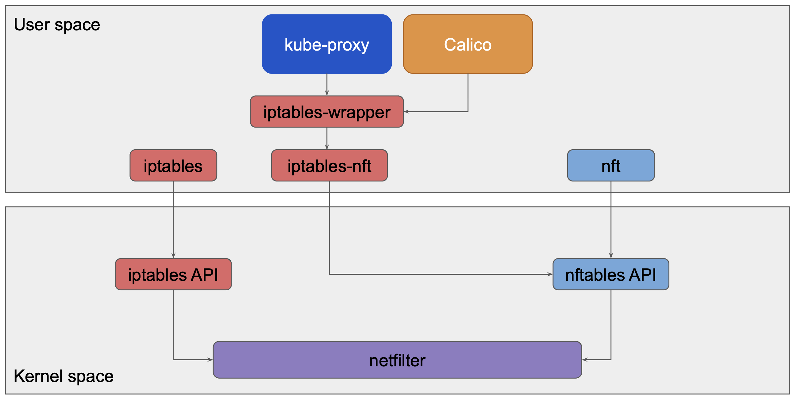
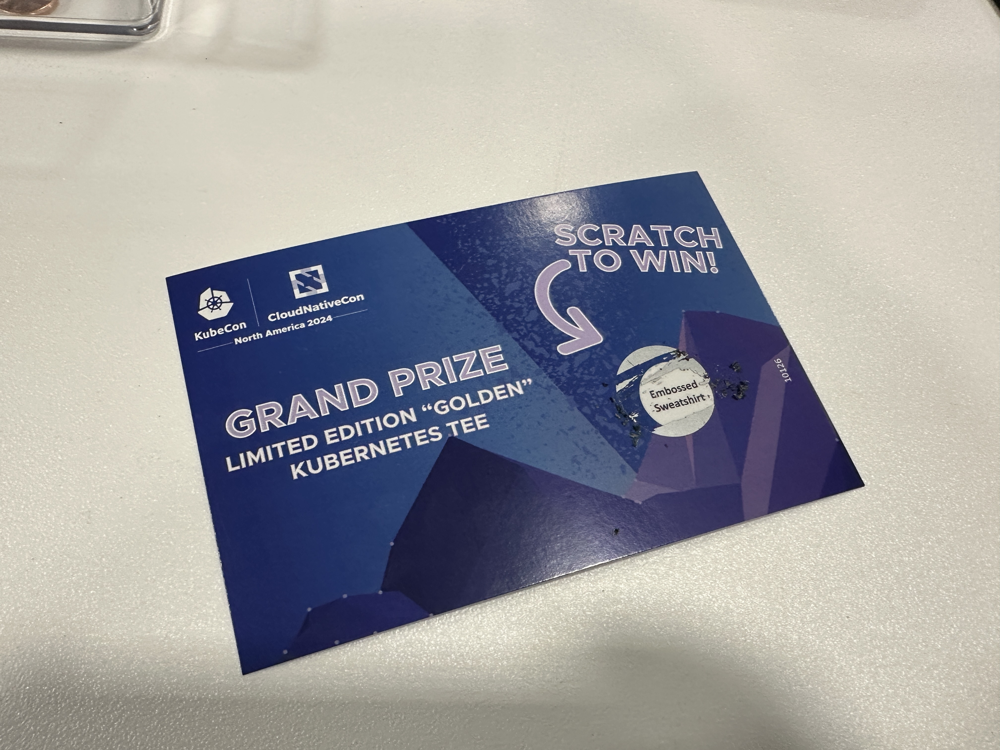

## Award Show

1. Adobe, over 5000 contributions to CNCF projects 🥇
2. Capital One, cloud-native banking 🏦
3. Reddit, a clear member of the CNCF subreddit 😉

## Today's Sessions

- Yahoo’s Kubernetes Journey from on-Prem to Multi-Cloud at Scale
- CNCF TAG Network: Intro & Deep Dive
- Kubernetes SIG Meet and Greet Lunch & Learn
- How the Tables Have Turned: Kubernetes Says Goodbye to Iptables
- Kubernetes Multi-Cluster Networking 101 (IDK why I attended this 😅)

## Favorite Session of the Day

### How the Tables Have Turned

Calico (and Linux generally) use iptables for packet filtering. It is the magic behind network policies and `kube-proxy`.

Calico introduced support for nftables in 3.29 but used an iptables-wrapper and iptables-nft library to continue to
interact with netfilter. The move to nftables is a tectonic shift by the Linux community, spearheaded by the top distros
to avoid further degradation of performance at the hands of pure iptables.

iptables was not designed for Kubernetes let alone its prospective scale. The very design of iptables and chains leads to
linear performance decline (the larger the ruleset, the slower it is to scan or make changes).

iptables is not suited for multiple users. Fun fact, kube-proxy and Calico or technically constantly in contention as they
both interact with the same chains frequently. Fortunately for the maintainers of both projects, Calico prepends its changes
to the top of the tables, while kube-proxy append to the end.

nftables tackles all of the shortcomings of iptables. It is far more efficient in handling large and complex rulesets.
Verdict map lookups are O(1) compared to iptables' O(n). nftables also supports multiple hook chains and added priorities
to avoid conflicts.

Fortunately for users, the transitions made so far have been seamless (due in part to the wrappers used). I expect
further shifts in the underlying architecture will be of no impact as long as Calico and the OS are kept up to date.

kube-proxy on the other hand still has rough edges. It was revealed that early tests with nftables yielded slower
performance. The teams are aware, have a potential corrective measure in mind and simply need more time to test and refine.

## Swag

My approach to swag is casual-—if it happens, it happens—-but I don’t view interactions with vendors as purely transactional.

No quid pro quo. No tolerating sales pitches in exchange for swag. Period.

I was fortunate to come across several vendors of interest that were also generous. Some were household names (Akamai,
HAProxy) with notable additions to their product lines, while others stood out for their intriguing marketing (Komodor)
or were associated with products I’d heard about and wanted to explore further (groundcover, Veeam).

### Veeam

Spoke to the folks at Veeam about their PV backup and restoration software. They gave me a bluetooth speaker cassette!

### Komodor

Komodor, still offering only SaaS 🙅🏽‍♂️, had in their possession a spectacular shield! (felt like Vibranium 😅)

Call me Kap...Kaptain Kubernetes works too! ☸️

### Winning 🏆

I later got lucky and won a much needed sweatshirt to survive another day of the dry cold.

