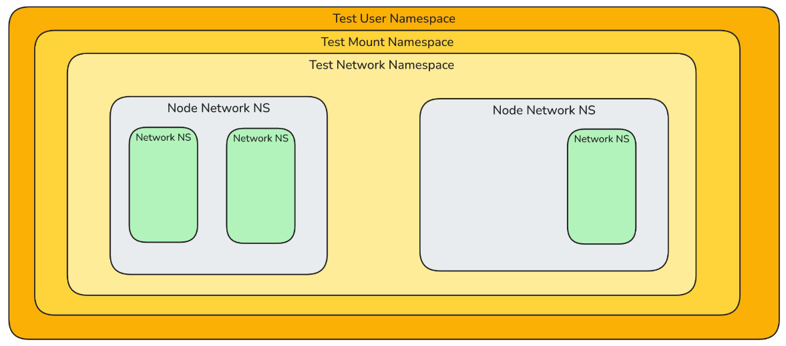
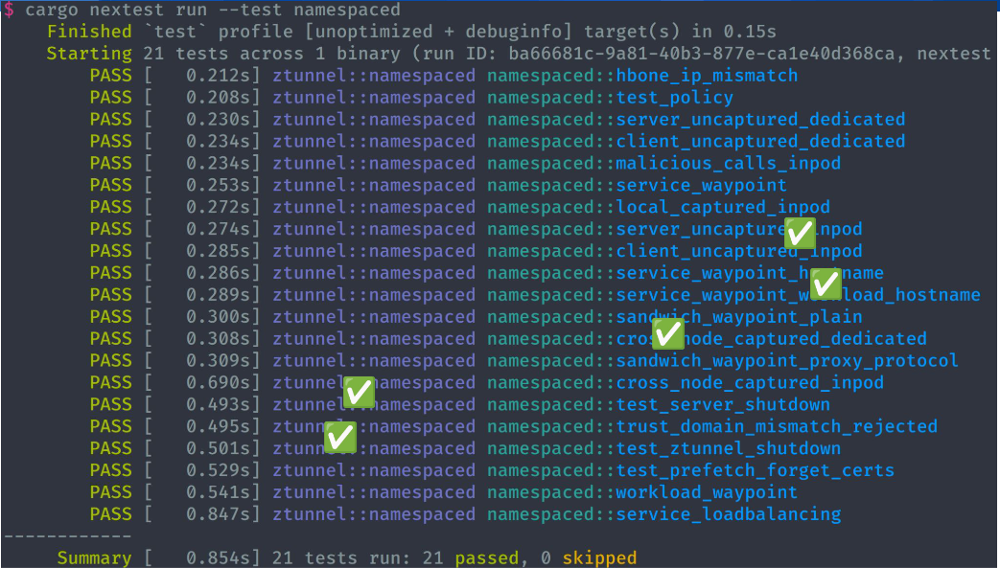
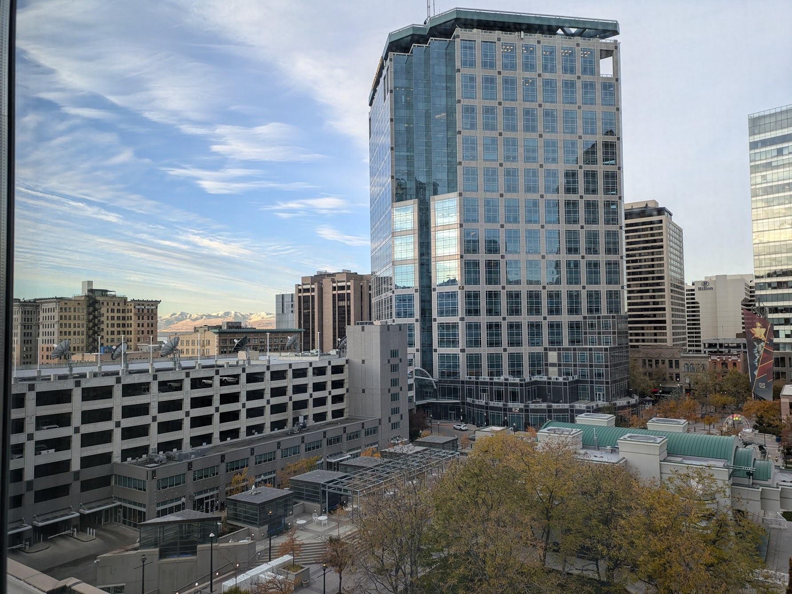

## Sessions of the Day

- Securing Outgoing Traffic: Building a Powerful Internet Egress Gateway for Reliable Connectivity
- Seeing Double? Implementing Multicast with eBPF and Cilium
- Testing Kubernetes Without Kubernetes: A Networking Deep Dive
- Thousands of Gamers, One Kubernetes Network
- Topology Aware Routing: Understanding the Tradeoffs
- Goodbye etcd! Running Kubernetes on Distributed PostgreSQL

## Multicast with eBPF and Cilium

Cilium's multicast support is in beta (at the time of writing). I believe the host of this talk is leading the delivery
of said feature set.

With the experience gained from writing a rate limiter, much of what was covered felt familiar.

We also store state in maps but their method of nesting hash maps is interesting. Outer map groups, inner map for subscribers.

The IGMP snooping seems to tap into `TC/TCX ingress` specifically at the `veth0` in the `host` network namespace. We
instead tap into `XDP` at the host `eth0`.

Identifying the type of IGMP version is contingent on defining and matching specific structs for each of the three versions.

Cloning and redirecting the applicable packets seemed straightforward, changing the destination to the veth of the pod(s)
in the group (after updating the MAC addr for multicast).

I continued to be impressed with how eBPF can augment networking capabilities.

## Testing Kubernetes Without Kubernetes: A Networking Deep Dive

Really fascinating talk about testing Kubernetes by simulating without docker or even root!

To test a pod, we recreate the underlying layers of namespaces

If we want to simulate connectivity between two pods, duplicate the namespaces! Notice the two node namespaces. This
simulates pods on different nodes when really sitting on the same node.

This could all spell significant savings in time and resources!

One recommendation made, which we also heard from Borkmann in the wireguard tweaks in Cilium talk a few days prior, is
the use of CPU pinning for consistency.

## Other Highlights

- Thousands of Gamers, One Kubernetes Network
  - Nvidia runs a pod for every client (gamer)!
  - Each pod is connected to three different networks (management, storage, game stream)
  - Uses ingress/egress/maximum bandwidth annotations for consistent experiences
  - OVN as network plugin
  - DSCP for added end-to-end QoS intelligence
    - Working to implement in `NetworkQoS` for upstream
- Goodbye etcd! Running Kubernetes on Distributed PostgreSQL
  - Using `kine` to translate etcd API calls to conventional DB specs (e.g. `postgres`)
  - Performance seems comparable
  - Resiliency contingent on DB chops

## Networking with Networking Folks

We had the pleasure of running into Duffie of Isovalent a few times both at Cloud Native Rejekts and KubeCon!

He was gracious enough to connect me with some talented colleagues in the eBPF space.

## Karaoke After Party

Many hits sung and united.

This absolute treasure performed an unexpected but excellent cover of Lamb of God's Laid to Rest! 🤘🏽

I was a (slight) metal head once upon a time. 😅

## Closing Thoughts

This week was an incredible dive into the Cloud Native world. The community is as strong as ever. The ideas, connections,
and inspiration I gathered were collectively a much needed refresher and invigorator that will shape my work moving forward.

Thank You!

A huge thanks to:

- Management for granting us the opportunity
- Shelton for the connections, direction and continued support
- Duffie of Isovalent for taking us under his wing
- Casey and Shaun of Tigera for the great convo and their insightful sessions
- The rest of the JPMC crew (Kat, Rasma, Sam, and Yogi) for enhancing the experience!
- Elie of Komodor for hooking me up with that shield! 😎

And to the City of Salt Lake for providing us a clean, crisp aired, safe and unique experience!

